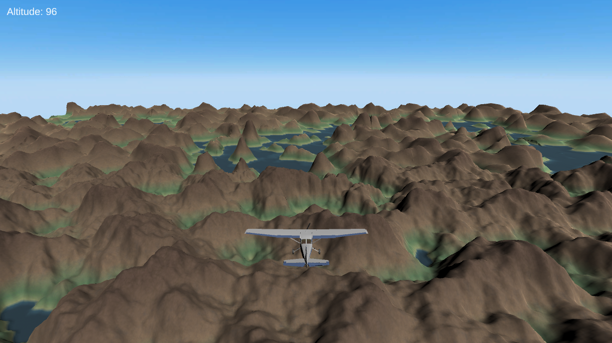
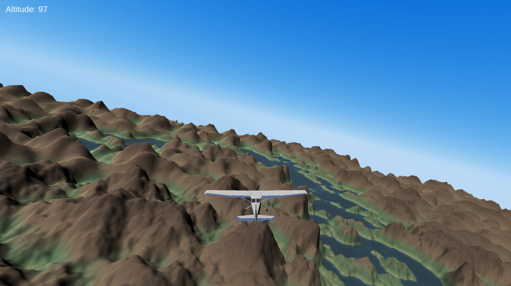

# Flight Simulator

Welcome to my flight simulator! 

This is a project I built using C# and Unity, where you control a plane through an infinite procedurally generated terrain. To generate terrain, a combination of Perlin and Simplex noise is used to achieve a mountainous look with occasional water areas.

Credit:

- Sebastian Lague: foundation of terrain generation
- Gasgiant: plane model
